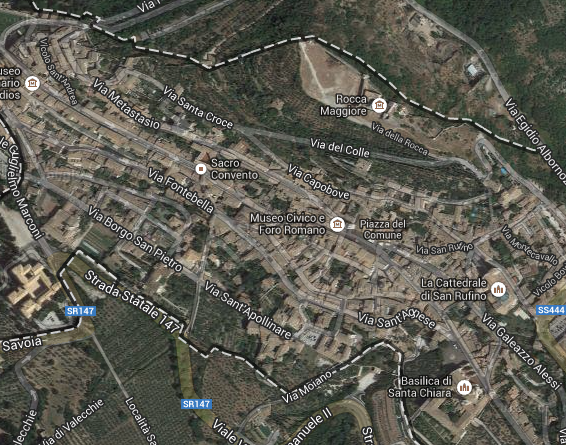

# Ci sposiamo!

## Il perchè di una data...

All'inizio, la scelta della fatidica data è stata quasi "accidentale", ma, dal momento che crediamo che nulla sia veramente avvenuto per caso, scopriamo il significato di questo giorno. il 21 Giugno è il **solstizio d'estate**, quindi il giorno più luminoso dell'anno (come ci ha ricordato la nostra amica Chiara). Si tratta di un giorno considerato sacro in molte religioni e magico per molte culture. Tra il 21 e il 22 Giugno il sole cambia direzione, simboleggiando l'inizio di un nuovo periodo di vita. Il passaggio alla bella stagione era salutato fin dall'antichità con canti e balli. E' il giorno più lungo dell'anno, perchè anche la nostra festa sia la più lunga possibile! Inoltre, in onore di Carmine, un'amica francese, Michele, ci ha detto che lo stesso giorno si celebra la ** festa della musica **. Il 21 Giugno si celebra ** San Luigi Gonzaga **, educato alle armi e poi diventato gesuita, patrono della gioventù. E non dimentichiamo che il 2014 è stato proclamato da Papa Francesco ** l'anno della Famiglia **. Insomma, cosa chiedere di più?

### Perché ci sposiamo

Donec a rutrum ligula. Nulla et diam sapien. In fringilla ante rutrum tortor cursus, id pellentesque metus dapibus. Vivamus auctor sed nibh non venenatis. Nunc vitae quam venenatis, sagittis eros sed, malesuada mi. Nunc eget elit vitae metus consequat feugiat. Vivamus at interdum ipsum, sed tincidunt velit. Suspendisse posuere arcu non faucibus dignissim. Quisque bibendum interdum purus, a tincidunt nunc lobortis at. Duis rhoncus, turpis quis bibendum mollis, lectus turpis vulputate est, sed rutrum mi lacus sed mi. Aenean ornare ut sapien ut pulvinar.

Sed at odio varius lacus sollicitudin porta at vitae orci. Etiam eget est in lacus dignissim scelerisque sed eget est. Nulla tristique tincidunt dolor malesuada dapibus. Quisque dictum hendrerit interdum. Sed non pretium neque, eu euismod purus. Aliquam dictum sagittis augue, sit amet lacinia tellus vestibulum condimentum. Pellentesque pharetra viverra urna non sollicitudin. Quisque luctus eget quam ac aliquam. Donec nisl elit, dictum vel est imperdiet, elementum molestie turpis. Nunc blandit odio quis turpis vestibulum accumsan. Nulla orci tortor, adipiscing at ipsum at, egestas cursus enim. Integer et adipiscing magna, sed feugiat eros.

## Come raggiungerci

Lorem ipsum dolor sit amet, consectetur adipiscing elit. Maecenas non est nisi. Pellentesque tellus enim, consectetur vitae lorem nec, pharetra viverra erat. Praesent vitae eros dictum, pulvinar nisi et, blandit dolor. Vivamus cursus diam ac porttitor convallis. Quisque nunc erat, dictum sed volutpat nec, vulputate at sem. Vestibulum tincidunt dui nec cursus ultrices. Sed vehicula erat urna, vitae gravida nunc cursus quis. uhmm.

Mauris pretium urna at convallis dapibus. Phasellus nec lorem lacinia, imperdiet neque in, malesuada nulla. Cras in vestibulum leo. Duis et dolor nec metus congue tincidunt. Etiam odio nulla, congue et tincidunt id, dignissim non libero. Pellentesque a lobortis enim, pulvinar elementum dolor. Duis rhoncus facilisis viverra. Duis tincidunt enim at sodales pretium. Maecenas id adipiscing est. Aliquam id mattis urna.
