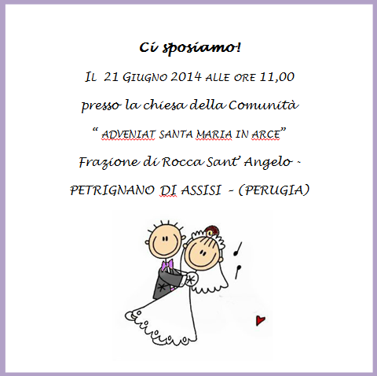
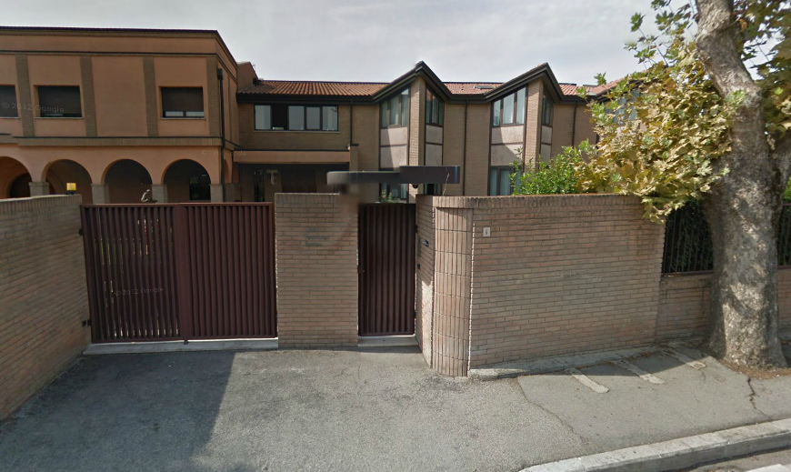
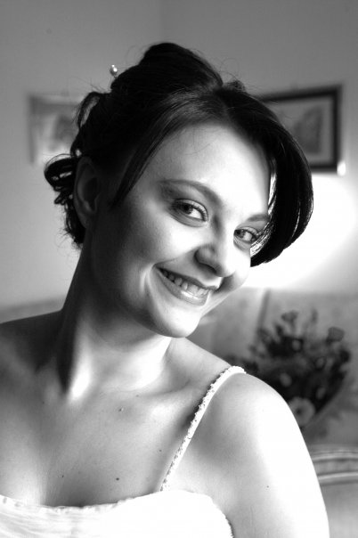
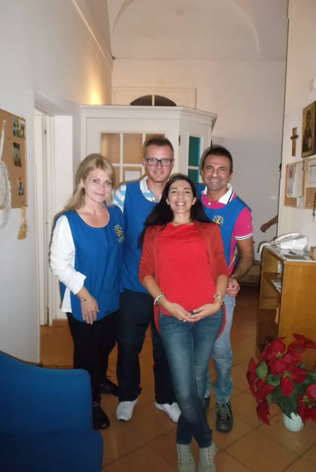

# Ci sposiamo!

## Perchè abbiamo scelto di sposarci?

Il matrimonio è la nostra vocazione! Parlarvi del nostro cammino e di tutto quello che abbiamo vissuto prima di incontrarci, sarebbe uno straordinario canto di Lode, un dolcissimo Magnificat, ma troppo lungo da descrivere qui. Padre Cornelio, che ci segue, ci ha detto di scrivere tutto. L'abbiamo fatto ed abbiamo riempito mezzo quaderno degli appunti! Non spaventatevi, non vogliamo annoiarvi! ;)

Pensiamo di poter riassumere tutta la nostra storia con un bellissimo passo tratto da **La bottega dell'orefice** di Karol Wojtyla:

>A un certo punto i nostri sguardi si sono incontrati – il mio e quello del vecchio Orefice. Ho avuto allora la sensazione che Lui non solo stesse sondando i nostri cuori ma che cercasse anche di versarvi dentro qualcosa.Ci siamo trovati al livello del Suo sguardo, anzi, al livello della Sua vita. La nostra intera esistenza stava davanti a Lui. Il Suo sguardo ci comunicava dei segni ma in quel momento non eravamo in grado di percepirli in tutta la loro pienezza ... — però quei segni riuscirono a penetrare fino nel fondo dei nostri cuori. E ... ci siamo messi in cammino nella direzione indicataci perché questo filo è diventato l'ordito di tutta la nostra vita.

## Il perchè di una data.

All'inizio, la scelta della fatidica data è stata quasi "accidentale", ma, dal momento che crediamo che nulla sia veramente avvenuto per caso, scopriamo il significato di questo giorno. il 21 Giugno è il **solstizio d'estate**, quindi il giorno più luminoso dell'anno (come ci ha ricordato la nostra amica Chiara). Si tratta di un giorno considerato sacro in molte religioni e magico per molte culture. Tra il 21 e il 22 Giugno il sole cambia direzione, simboleggiando l'inizio di un nuovo periodo di vita. Il passaggio alla bella stagione era salutato fin dall'antichità con canti e balli. E' il giorno più lungo dell'anno, perchè anche la nostra festa sia la più lunga possibile! Inoltre, in onore di Carmine, un'amica francese, Michele, ci ha detto che lo stesso giorno si celebra la **festa della musica**. Il 21 Giugno si festeggia **San Luigi Gonzaga**, educato alle armi e poi diventato gesuita, patrono della gioventù. E non dimentichiamo che il 2014 è stato proclamato da Papa Francesco **anno della Famiglia**. Insomma, cosa chiedere di più?

## Perchè il matrimonio cristiano? 

Vorremo testimoniare la serietà e la bellezza di questo Sacramento, che non è nè una bella chiesa nè una festa grandiosa. Abbiamo scelto di non preoccuparci troppo del vestito, degli addobbi o delle bomboniere. Chi si è sposato o sta per farlo sa quanto sia stressante organizzare una festa perfetta: ci si perde in un vortice di paganità che ti allontana dal vero senso di quel giorno (il tema; il colore dominante; il segnaposto; il paggetto; i fiori; le prove trucco; ecc). Perdonateci,ma noi abbiamo scelto di pensare a ciò che succederà dal 22 Giugno in poi!

**Condividiamo le parole che Papa Francesco ha rivolto al pellegrinaggio delle famiglie, nell'Ottobre del 2013** :

"Chi si sposa nel Sacramento dice: «Prometto di esserti fedele sempre, nella gioia e nel dolore, nella salute e nella malattia, e di amarti e onorarti tutti i giorni della mia vita». Gli sposi in quel momento non sanno cosa accadrà (...) Partono, come Abramo, si mettono in cammino insieme. **E questo è il matrimonio! Partire e camminare insieme, mano nella mano, affidandosi alla grande mano del Signore.** Mano nella mano, sempre e per tutta la vita! E non fare caso a questa cultura del provvisorio, che ci taglia la vita a pezzi!
Con questa fiducia nella fedeltà di Dio si affronta tutto, senza paura, con responsabilità. Gli sposi cristiani non sono ingenui, conoscono i problemi e i pericoli della vita. Ma non hanno paura di assumersi la loro responsabilità, davanti a Dio e alla società. Senza scappare, senza isolarsi, senza rinunciare alla missione di formare una famiglia e di mettere al mondo dei figli. - Ma oggi, Padre, è difficile… -. Certo, è difficile. Per questo ci vuole la grazia, la grazia che ci dà il Sacramento! I Sacramenti non servono a decorare la vita - ma che bel matrimonio, che bella cerimonia, che bella festa!… - Ma quella è una decorazione! E la grazia non è per decorare la vita, è per farci forti nella vita, per farci coraggiosi, per poter andare avanti!"

## Il luogo della cerimonia.

La cerimonia si svolgerà presso la chiesa della Comunità delle **suore francescane dell'Adveniat, S. Maria in Arce**. Il convento si trova a Rocca S.Angelo, frazione di Petrignano, a 13 km dal santuario della Porziuncola. Vi chiediamo un piccolo sforzo per raggiungere questa incantevole chiesetta del 1200, arroccata sulla collina. Per noi questo posto è ricco di significato: vi abbiamo fatto un bellissimo ritiro spirituale di coppia nell'Agosto scorso, dal quale è scaturita la scelta di sposarci e la data. 

<a href="https://maps.google.it/maps?f=d&amp;source=embed&amp;saddr=Santa+Maria+degli+Angeli,+PG&amp;daddr=Comunita'+Adveniat+S+Maria+In+Arce,+Assisi,+PG&amp;hl=it&amp;geocode=FbIBkQIdFuW_ACmvejRAAJ0uEzEQg0ZakywICg%3BFRMNkgIdaKO_ACGLjXk6vmMVuyn54EtEFycsEzGLjXk6vmMVuw&amp;aq=0&amp;oq=comunit%C3%A0+adv&amp;sll=41.008099,16.727239&amp;sspn=2.520221,4.938354&amp;t=m&amp;mra=ls&amp;ie=UTF8&amp;ll=43.090704,12.555656&amp;spn=0.087752,0.145912&amp;z=12">.Visualizza la mappa ingrandita.</a>

Per saperne di più sulla comunità **delle suore dell'Adveniat Santa Maria in Arce**, cliccate sul seguente [link] (http://www.adveniatsantamariainarce.it/)

##La veglia.

Stiamo organizzando un **addio al nubilato/celibato** un pò insolito,ma speciale!Ti chiediamo di pregare con noi e per noi, con la nostra testimonianza e con l'allegria della musica e dei canti. Ti aspettiamo il **20 Giugno** alle **ore 21,00** presso la cappella della casa "Laudato sii" delle **suore francescane Angeline**, in via Protomartiri Francescani 6, a Santa Maria degli Angeli. 

Trovarla è facile: si tratta di un edificio che si trova alle spalle del santuario della Porziuncola.

 

##I testimoni ("I compari e le commari").

Abbiamo scelto due membri delle nostre famiglie d'origine:

**Massimo**, fratello di Anita

**Tina** , sorella di Carmine

E due amici volontari, membri della nostra famiglia "spirituale":

**Sonia e Vincenzo**.

Abbiamo così intrecciato i fili della nostra storia, unendo il "prima" delle persone con cui siamo cresciuti e il "dopo" del nostro incontro e del fidanzamento.
Il nostro **Grazie** va a tutti loro che continuano ad accompagnarci! 

